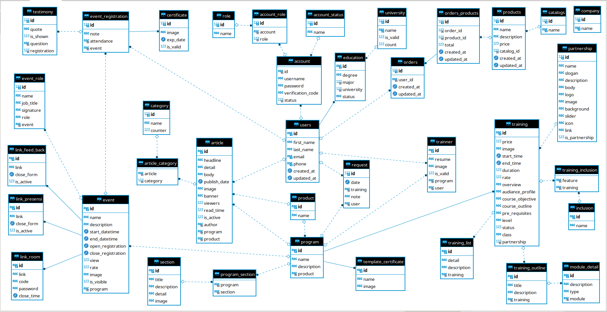

### Курсовой проект

В рамках курсового проекта разрабатывалась база для платформы образовательного учреждения.

#### ER_Diagram

#### Описание таблиц

Для реализации её функционало было созданно 37 таблиц
1. users хранит в себе информацию о зарегистрированных пользователях
2. catalogs хранит в себе информацию о названиях разделов
3. products хранит в себе информацию о названиях продуктов
4. orders хранит в себе информацию о заказах
5. orders_products хранит в себе информацию о колличестве заказанных продуктов
6. company хранит в себе информацию о названии компании
7. account хранит в себе информацию о аккаунте
8. account_status хранит в себе информацию о статусе аккаунта
9. article хранит в себе информацию о лекциях
10. category хранит в себе информацию о категориях
11. education хранит в себе информацию о образовании
12. event хранит в себе информацию о событиях
13. inclusion хранит в себе информацию о включении
14. link_feed_back служит для обратной связи
15. link_room служит для записи домашней ссылки
16. link_presensi служит для активации наличие ссылки
17. module_detail хранит в себе информацию о деталях модуля
18. partnership хранит в себе информацию о сотрудничестве
19. product хранит в себе информацию о продукте
20. program хранит в себе информацию о программах
21. role хранит в себе информацию о ролях
22. section хранит в себе информацию о разделах
23. template_certificate хранит в себе информацию о шаблоне сертификата
24. training хранит в себе информацию о курсе обучения
25. training_list хранит в себе информацию по листу обучения
26. training_outline хранит в себе информацию о плане обучения
27. university хранит в себе информацию о университетах
28. account_role хранит в себе информацию о ролях аккаунтов
29. article_category хранит в себе информацию о категории статей
30. certificate хранит в себе информацию о сертификате
31. event_registration хранит в себе информацию о регистрации событий
32. event_role хранит в себе информацию о ролях событий
33. program_section хранит в себе информацию о разделах программ
34. request хранит в себе информацию о запросах
35. testimony хранит в себе информацию о свидетельстве
36. training_inclusion хранит в себе информацию о включение в обучение
37. trainner хранит в себе информацию о преподователях
